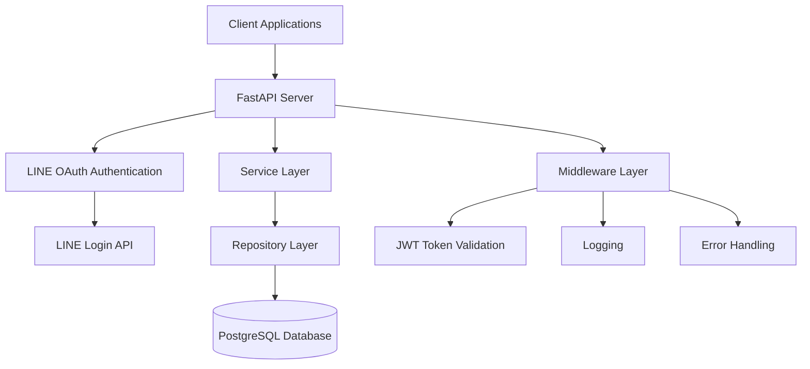

# Design Document

## Overview

このAPIサーバーは、FastAPIフレームワークを基盤とした高性能なRESTful APIサーバーです。PostgreSQLデータベースとSQLModel ORMを使用してデータ永続化を行い、LINEログインによるOAuth認証を実装します。uvによる依存関係管理とRuffによるコード品質管理を採用し、型安全性を重視して包括的な型ヒントを使用してコードの保守性と信頼性を確保します。

## Architecture

### High-Level Architecture



### Project Structure

```
api-server/
├── pyproject.toml              # uv project configuration
├── src/
│   └── api_server/
│       ├── __init__.py
│       ├── main.py             # FastAPI application entry point
│       ├── config.py           # Configuration management
│       ├── database.py         # Database connection and setup
│       ├── models/             # SQLModel data models
│       │   ├── __init__.py
│       │   ├── user.py
│       │   └── item.py
│       ├── repositories/       # Data access layer
│       │   ├── __init__.py
│       │   ├── user_repository.py
│       │   └── item_repository.py
│       ├── services/           # Business logic layer
│       │   ├── __init__.py
│       │   ├── auth_service.py
│       │   └── item_service.py
│       ├── routers/            # API route handlers
│       │   ├── __init__.py
│       │   ├── health.py
│       │   ├── auth.py
│       │   └── items.py
│       └── schemas/            # Pydantic schemas for API
│           ├── __init__.py
│           ├── auth_schemas.py
│           └── item_schemas.py
├── tests/                      # Test files
│   ├── __init__.py
│   ├── conftest.py
│   ├── test_health.py
│   └── test_items.py
└── README.md
```

## Components and Interfaces

### 1. FastAPI Application (main.py)

FastAPIアプリケーションのメインエントリーポイント。ルーターの登録、ミドルウェアの設定、データベース接続の初期化を行います。

```python
from typing import Any
from fastapi import FastAPI
from contextlib import asynccontextmanager

@asynccontextmanager
async def lifespan(app: FastAPI) -> Any:
    # Startup logic
    yield
    # Shutdown logic

app = FastAPI(
    title="API Server",
    description="FastAPI server with PostgreSQL and SQLModel",
    version="1.0.0",
    lifespan=lifespan
)
```

### 2. Configuration Management (config.py)

環境変数を使用した設定管理。Pydanticの設定機能を活用します。

```python
from pydantic_settings import BaseSettings
from typing import Optional

class Settings(BaseSettings):
    database_url: str
    debug: bool = False
    log_level: str = "INFO"
    
    # LINE Login Configuration
    line_client_id: str
    line_client_secret: str
    line_redirect_uri: str
    
    # JWT Configuration
    jwt_secret: str
    jwt_algorithm: str = "HS256"
    jwt_expire_minutes: int = 60 * 24  # 24 hours
    
    class Config:
        env_file = ".env"
```

### 3. Database Layer (database.py)

SQLModelとPostgreSQLの接続管理。接続プールとセッション管理を含みます。

```python
from sqlmodel import SQLModel, create_engine, Session
from typing import Generator

engine = create_engine(database_url, echo=debug)

def get_session() -> Generator[Session, None, None]:
    with Session(engine) as session:
        yield session
```

### 4. Data Models (models/)

SQLModelを使用したデータベースモデル定義。型ヒントを完全に活用します。

```python
from sqlmodel import SQLModel, Field
from typing import Optional
from datetime import datetime

class ItemBase(SQLModel):
    name: str = Field(max_length=100)
    description: Optional[str] = None
    price: float = Field(gt=0)

class Item(ItemBase, table=True):
    id: Optional[int] = Field(default=None, primary_key=True)
    created_at: datetime = Field(default_factory=datetime.utcnow)
    updated_at: Optional[datetime] = None
```

### 5. Repository Layer (repositories/)

データアクセスパターンの実装。データベース操作を抽象化します。

```python
from typing import List, Optional
from sqlmodel import Session, select
from models.item import Item

class ItemRepository:
    def __init__(self, session: Session) -> None:
        self.session = session
    
    async def get_all(self) -> List[Item]:
        # Implementation
        pass
    
    async def get_by_id(self, item_id: int) -> Optional[Item]:
        # Implementation
        pass
```

### 6. Service Layer (services/)

ビジネスロジックの実装。リポジトリを使用してデータ操作を行います。

```python
from typing import List, Optional
from repositories.item_repository import ItemRepository
from schemas.item_schemas import ItemCreate, ItemUpdate

class ItemService:
    def __init__(self, repository: ItemRepository) -> None:
        self.repository = repository
    
    async def create_item(self, item_data: ItemCreate) -> Item:
        # Business logic implementation
        pass
```

### 7. Authentication Service (services/auth_service.py)

LINEログインとJWTトークン管理を行います。

```python
from typing import Optional
import httpx
import jwt
from datetime import datetime, timedelta

class AuthService:
    def __init__(self, line_client_id: str, line_client_secret: str, jwt_secret: str) -> None:
        self.line_client_id = line_client_id
        self.line_client_secret = line_client_secret
        self.jwt_secret = jwt_secret
    
    async def verify_line_token(self, access_token: str) -> Optional[dict]:
        # LINE API verification
        pass
    
    def create_jwt_token(self, user_id: str) -> str:
        # JWT token creation
        pass
    
    def verify_jwt_token(self, token: str) -> Optional[dict]:
        # JWT token verification
        pass
```

### 8. API Routers (routers/)

FastAPIルーターによるエンドポイント定義。依存性注入を活用します。

```python
from fastapi import APIRouter, Depends, HTTPException
from typing import List
from services.item_service import ItemService

router = APIRouter(prefix="/api/items", tags=["items"])

@router.get("/", response_model=List[ItemResponse])
async def get_items(
    service: ItemService = Depends(get_item_service),
    current_user: User = Depends(get_current_user)
) -> List[ItemResponse]:
    # Endpoint implementation
    pass
```

## Data Models

### User Model

LINEログインユーザーエンティティ：

- **id**: 主キー（自動生成）
- **line_user_id**: LINE ユーザーID（必須、ユニーク）
- **display_name**: 表示名（必須）
- **picture_url**: プロフィール画像URL（オプション）
- **email**: メールアドレス（オプション）
- **created_at**: 作成日時（自動設定）
- **updated_at**: 更新日時（更新時に自動設定）

### Item Model

基本的なアイテムエンティティ：

- **id**: 主キー（自動生成）
- **name**: アイテム名（必須、最大100文字）
- **description**: アイテム説明（オプション）
- **price**: 価格（必須、正の数値）
- **user_id**: 作成者のユーザーID（外部キー）
- **created_at**: 作成日時（自動設定）
- **updated_at**: 更新日時（更新時に自動設定）

### API Schemas

#### Authentication Schemas
- **LineLoginRequest**: LINEログインリクエスト用スキーマ
- **TokenResponse**: JWTトークンレスポンス用スキーマ
- **UserResponse**: ユーザー情報レスポンス用スキーマ

#### Item Schemas
- **ItemCreate**: アイテム作成用スキーマ
- **ItemUpdate**: アイテム更新用スキーマ
- **ItemResponse**: API レスポンス用スキーマ

## Error Handling

### Exception Hierarchy

```python
class APIException(Exception):
    def __init__(self, status_code: int, detail: str) -> None:
        self.status_code = status_code
        self.detail = detail

class ItemNotFoundException(APIException):
    def __init__(self, item_id: int) -> None:
        super().__init__(404, f"Item with id {item_id} not found")

class ValidationException(APIException):
    def __init__(self, detail: str) -> None:
        super().__init__(400, detail)
```

### Global Exception Handler

FastAPIのグローバル例外ハンドラーを使用して、一貫したエラーレスポンスを提供します。

```python
from fastapi import Request
from fastapi.responses import JSONResponse

@app.exception_handler(APIException)
async def api_exception_handler(request: Request, exc: APIException) -> JSONResponse:
    return JSONResponse(
        status_code=exc.status_code,
        content={"error": exc.detail}
    )
```

## Testing Strategy

### Test Structure

1. **Unit Tests**: 各コンポーネントの単体テスト
   - Service layer tests
   - Repository layer tests
   - Model validation tests

2. **Integration Tests**: API エンドポイントのテスト
   - Database integration tests
   - Full API workflow tests

3. **Test Database**: 
   - SQLiteを使用したインメモリテストデータベース
   - テスト用のデータベースフィクスチャ

### Test Configuration

```python
# conftest.py
import pytest
from fastapi.testclient import TestClient
from sqlmodel import Session, SQLModel, create_engine
from sqlmodel.pool import StaticPool

@pytest.fixture
def test_session() -> Session:
    engine = create_engine(
        "sqlite:///:memory:",
        connect_args={"check_same_thread": False},
        poolclass=StaticPool,
    )
    SQLModel.metadata.create_all(engine)
    with Session(engine) as session:
        yield session

@pytest.fixture
def client(test_session: Session) -> TestClient:
    # Test client setup
    pass
```

### Development Tools Integration

- **Ruff**: リンティングとフォーマッティング
- **mypy**: 型チェック
- **pytest**: テストフレームワーク
- **pytest-asyncio**: 非同期テストサポート

### Environment Configuration

開発、テスト、本番環境の設定管理：

```python
class Settings(BaseSettings):
    environment: str = "development"
    database_url: str
    test_database_url: Optional[str] = None
    debug: bool = False
    log_level: str = "INFO"
    
    @property
    def is_development(self) -> bool:
        return self.environment == "development"
    
    @property
    def is_testing(self) -> bool:
        return self.environment == "testing"
```